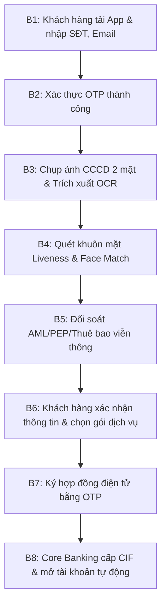
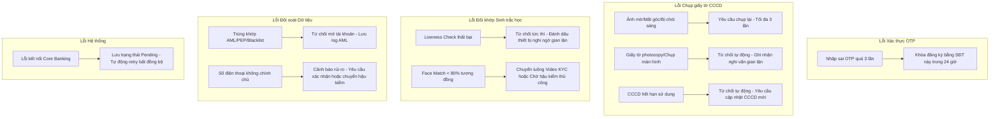

# TÀI LIỆU PHÂN TÍCH HỆ THỐNG eKYC (ABC BANK)
**Dự án:** Số hóa quy trình mở tài khoản và phát hành thẻ trực tuyến  
**Vai trò:** Senior Business Analyst (FinTech & Digital Banking)  
**Mục tiêu:** Thiết lập quy trình định danh điện tử tự động hóa hoàn toàn (*Zero manual operation*), đảm bảo an toàn, bảo mật và tuân thủ pháp lý.

---

## A. ACTORS (CÁC TÁC NHÂN HỆ THỐNG)

Hệ thống eKYC tương tác với nhiều tác nhân khác nhau, được phân loại cụ thể như sau:

| Loại Tác Nhân | Tên Tác Nhân | Mô Tả Vai Trò |
| :--- | :--- | :--- |
| **Primary Actor** (Tác nhân chính) | **Khách hàng (Customer)** | Khách hàng cá nhân sử dụng ứng dụng di động ABC Bank Mobile để đăng ký và thực hiện quy trình eKYC nhằm mở tài khoản ngân hàng. |
| **Secondary Actor** (Tác nhân phụ/Nội bộ) | **Hệ thống Core Banking** | Thực hiện xử lý nghiệp vụ ngân hàng: Khởi tạo thông tin khách hàng (CIF), cấp số tài khoản và thiết lập hạn mức giao dịch tự động. |
| | **Hệ thống eKYC Engine** | Bộ xử lý trung tâm xử lý OCR, Liveness Check, Face Match và chấm điểm rủi ro (Fraud Scoring). |
| | **Giao dịch viên Kiểm soát (Back-office/Fraud Analyst)** | Nhân viên hậu kiểm hoặc xử lý rủi ro. Chỉ can thiệp khi có cảnh báo gian lận hệ thống hoặc kiểm tra định kỳ (không tham gia luồng phê duyệt trực tiếp của khách hàng hợp lệ để đảm bảo mục tiêu *Zero manual operation*). |
| | **Quản trị viên Hệ thống (System Admin)** | Quản lý cấu hình tham số hệ thống (ngưỡng đối khớp khuôn mặt, hạn mức thử lại, quy tắc chặn blacklist). |
| **External Actor** (Tác nhân bên ngoài) | **Nhà cung ứng viễn thông (Telcos)** | Cung cấp dịch vụ đối khớp thông tin thuê bao di động (họ tên, số CCCD/CMND) để xác thực số điện thoại chính chủ. |
| | **Cơ sở dữ liệu Quốc gia về Dân cư (RAR / C06)** | Cung cấp dịch vụ đối soát thông tin CCCD gắn chip (thông qua luồng đọc thẻ NFC hoặc cổng kết nối được Bộ Công an cấp phép). |
| | **Hệ thống Tra cứu Danh sách đen (AML/PEP/CIC)** | Cung cấp dữ liệu để đối chiếu phòng chống rửa tiền (AML), danh sách chính trị gia (PEP) và lịch sử tín dụng xấu. |
| | **Gateway Gửi tin (SMS/Email Gateway)** | Nhà cung cấp dịch vụ gửi OTP và thư điện tử thông báo trạng thái tài khoản. |

---

## B. BUSINESS FLOW (LUỒNG NGHIỆP VỤ CHI TIẾT)

### 1. Luồng chính thành công (Happy Path)

*   **Bước 1: Khởi động & Nhập thông tin đầu vào:** Khách hàng tải app ABC Bank, chọn "Mở tài khoản trực tuyến" và nhập Số điện thoại, Email.
*   **Bước 2: Xác thực Số điện thoại:** Hệ thống gửi mã OTP qua SMS. Khách hàng nhập OTP chính xác để tiếp tục luồng.
*   **Bước 3: Chụp ảnh CCCD:** Khách hàng chụp ảnh mặt trước và mặt sau của CCCD gốc. Hệ thống chạy OCR để tự động điền các trường thông tin (Họ tên, Ngày sinh, Số CCCD, Quê quán, Địa chỉ thường trú, Ngày hết hạn).
*   **Bước 4: Quét khuôn mặt (Liveness Check & Face Match):** Khách hàng quét khuôn mặt theo hướng dẫn động của camera. Hệ thống xác định đây là người thật đang thao tác trực tiếp (*Liveness Detection*) và so khớp ảnh camera với ảnh trên CCCD (*Face Matching 1:1*).
*   **Bước 5: Đối soát dữ liệu tự động:**
    *   Hệ thống kiểm tra thông tin chủ thuê bao di động của Số điện thoại đăng ký (qua Telco API) xem có trùng khớp họ tên/CCCD hay không.
    *   Hệ thống đối khớp danh sách AML/PEP và kiểm tra blacklist nội bộ của ABC Bank.
*   **Bước 6: Xác nhận thông tin:** Khách hàng xác nhận lại thông tin trích xuất từ OCR (cho phép chỉnh sửa địa chỉ liên hệ nếu cần) và chọn số tài khoản đẹp/gói tài khoản.
*   **Bước 7: Ký hợp đồng điện tử (E-contract):** Hệ thống hiển thị hợp đồng điện tử mở tài khoản. Khách hàng bấm đồng ý và xác nhận ký số bằng mã OTP gửi về điện thoại.
*   **Bước 8: Khởi tạo dịch vụ:** Hệ thống eKYC tự động đẩy dữ liệu sang Core Banking. Core Banking tạo CIF, cấp số tài khoản và kích hoạt ứng dụng ngân hàng số tức thì. Hệ thống gửi SMS/Email chúc mừng kèm thông tin tài khoản cho khách hàng.

---

### 2. Luồng ngoại lệ & Cách thức xử lý (Exception Paths)

---

## C. FUNCTIONAL REQUIREMENTS (YÊU CẦU CHỨC NĂNG)

Để đảm bảo mục tiêu *Zero manual operation*, các chức năng cần được tự động hóa tối đa và phân loại theo các phân hệ (Module) như sau:

### Module 1: Đăng ký & Xác thực ban đầu (Onboarding & OTP)
*   **FR-1.1:** Hệ thống phải cho phép khách hàng đăng ký Số điện thoại và Email.
*   **FR-1.2:** Hệ thống phải tạo và gửi mã SMS OTP (6 chữ số, hiệu lực 2 phút) đến số điện thoại đăng ký.
*   **FR-1.3:** Hệ thống phải kiểm tra số lần nhập sai OTP (khóa tạm thời 24h nếu nhập sai quá 3 lần liên tiếp) để tránh tấn công brute-force.
*   **FR-1.4:** Hệ thống phải tự động kiểm tra số điện thoại đăng ký đã tồn tại trên Core Banking của ABC Bank chưa. Nếu đã có tài khoản, hướng dẫn người dùng khôi phục mật khẩu thay vì mở mới.

### Module 2: Nhận diện giấy tờ tùy thân (OCR Module)
*   **FR-2.1:** Hệ thống phải tự động phân biệt loại giấy tờ (CCCD 9 số, CCCD 12 số, CCCD gắn chip, Hộ chiếu) dựa trên hình ảnh chụp.
*   **FR-2.2:** Hệ thống phải trích xuất chính xác thông tin trên giấy tờ tùy thân bằng công nghệ OCR (Họ tên, Số CCCD, Ngày sinh, Giới tính, Quê quán, Địa chỉ thường trú, Ngày cấp, Ngày hết hạn).
*   **FR-2.3:** Hệ thống phải tự động tính toán thời hạn hiệu lực của giấy tờ. Nếu giấy tờ hết hạn tại thời điểm thực hiện eKYC, hệ thống phải dừng luồng nghiệp vụ và báo lỗi.
*   **FR-2.4:** Hệ thống phải kiểm tra chất lượng ảnh chụp (độ sáng, độ nét, mất góc, lóa sáng) trước khi gửi lên máy chủ và yêu cầu người dùng chụp lại ngay tại client nếu không đạt chất lượng tối thiểu.
*   **FR-2.5:** Hệ thống phải thực hiện các thuật toán chống giả mạo giấy tờ (chụp lại từ màn hình khác, in ấn lại màu, bị chỉnh sửa kỹ thuật số).

### Module 3: Xác thực sinh trắc học khuôn mặt (Biometrics Module)
*   **FR-3.1:** Hệ thống phải thực hiện **Passive & Active Liveness Check** để đảm bảo đối tượng quét camera là người dùng thật, đang tương tác thực tế (không phải ảnh tĩnh, video phát lại, mặt nạ silicon).
*   **FR-3.2:** Hệ thống phải thực hiện so sánh đối khớp khuôn mặt (*Face Matching 1:1*) giữa khuôn mặt chụp trực tiếp từ camera và ảnh trên giấy tờ tùy thân.
*   **FR-3.3:** Hệ thống phải đưa ra kết quả điểm tương đồng (*Confidence Score*) và so sánh với ngưỡng cấu hình sẵn (ví dụ: >= 80%).

### Module 4: Đối soát & Phòng chống gian lận (Fraud & Compliance Module)
*   **FR-4.1:** Hệ thống phải tích hợp API với các nhà mạng viễn thông (Telcos) để đối chiếu thông tin thuê bao số điện thoại với họ tên và số CCCD trích xuất từ bước OCR.
*   **FR-4.2:** Hệ thống phải tự động gọi API đối chiếu với cơ sở dữ liệu danh sách đen (Blacklist), danh sách cấm vận phòng chống rửa tiền (AML), danh sách chính trị gia (PEP).
*   **FR-4.3:** Hệ thống phải tích hợp giải pháp chấm điểm gian lận thiết bị (Device Fingerprinting, IP Geolocation) để phát hiện hành vi mở tài khoản hàng loạt trên cùng một thiết bị hoặc từ các dải IP bất thường.

### Module 5: Ký hợp đồng & Phát hành dịch vụ tự động (Core Banking Integration)
*   **FR-5.1:** Hệ thống phải tự động tạo mẫu hợp đồng mở tài khoản và dịch vụ ngân hàng điện tử với thông tin khách hàng lấy từ OCR và ảnh chữ ký (nếu có).
*   **FR-5.2:** Hệ thống phải cho phép khách hàng xem hợp đồng trực quan và xác nhận ký bằng mã OTP (Electronic Signature).
*   **FR-5.3:** Hệ thống phải tích hợp dịch vụ gọi API sang Core Banking để khởi tạo CIF mới, mở tài khoản thanh toán và cấp dịch vụ E-Banking tự động trong thời gian thực.
*   **FR-5.4:** Hệ thống phải tự động gửi SMS thông báo thông tin số tài khoản và liên kết kích hoạt E-Banking sau khi hoàn thành.

---

## D. NON-FUNCTIONAL REQUIREMENTS (YÊU CẦU PHI CHỨC NĂNG)

Để đảm bảo vận hành ổn định cho một hệ thống ngân hàng lớn, các yêu cầu phi chức năng sau cần được cam kết thiết kế:

### 1. Bảo mật (Security)
*   **Mã hóa truyền tải (In-transit):** Toàn bộ dữ liệu kết nối giữa thiết bị di động của khách hàng và máy chủ ngân hàng phải qua giao thức HTTPS bảo mật nâng cao (sử dụng TLS 1.3 và cơ chế SSL Pinning trên App di động để chống tấn công Man-in-the-Middle).
*   **Mã hóa lưu trữ (At-rest):** Thông tin định danh cá nhân (PII), ảnh chụp CCCD, và dữ liệu khuôn mặt dạng vector sinh trắc học phải được mã hóa bằng chuẩn AES-256 trước khi lưu vào Cơ sở dữ liệu.
*   **An toàn ứng dụng:** Ứng dụng di động phải có tính năng chống dịch ngược (Obfuscation), chặn chụp ảnh/quay phim màn hình trong luồng eKYC và chặn ứng dụng chạy trên các thiết bị đã Root hoặc Jailbreak.
*   **Tiêu chuẩn bảo mật:** Đạt chuẩn bảo mật dữ liệu thẻ PCI-DSS và các quy định an toàn thông tin cấp độ 3 theo tiêu chuẩn nhà nước.

### 2. Hiệu năng (Performance)
*   **Thời gian phản hồi nghiệp vụ (Response Time):**
    *   Thời gian xử lý OCR trích xuất thông tin ảnh CCCD: < 1.5 giây.
    *   Thời gian xử lý đối khớp khuôn mặt (Face Matching 1:1) và Liveness Check: < 2.0 giây.
    *   Tổng thời gian thực hiện toàn bộ luồng eKYC của khách hàng từ bước nhập OTP đến khi nhận được số tài khoản (không tính thời gian khách hàng thao tác chụp ảnh): < 10 giây.
*   **Khả năng chịu tải (Throughput):** Hệ thống eKYC Engine phải chịu tải được tối thiểu **200 giao dịch đồng thời (TPS)** tại thời điểm bình thường và khả năng tự động scale lên **1000 TPS** vào giờ cao điểm mà không bị sập hay trễ dịch vụ.

### 3. Khả năng mở rộng & Khả năng dự phòng (Scalability & Redundancy)
*   **Scalability:** Kiến trúc hệ thống xây dựng theo mô hình **Microservices**, triển khai trên nền tảng Container (Docker, Kubernetes) để hỗ trợ tự động mở rộng theo nhu cầu (Auto-scaling).
*   **High Availability (HA):** Triển khai mô hình **Active-Active** ở hai trung tâm dữ liệu độc lập (DC và DR).
*   **Cam kết dịch vụ (SLA):** Khả năng sẵn sàng của hệ thống đạt tối thiểu **99.9%** (Uptime 24/7/365).

### 4. Tuân thủ pháp lý (Compliance)
*   **Thông tư 16/2020/TT-NHNN:** Đảm bảo tuân thủ giới hạn tổng hạn mức giao dịch qua tài khoản eKYC không quá 100 triệu đồng/tháng (nếu chưa nâng cấp qua phương thức KYC gặp mặt trực tiếp hoặc Video KYC đạt chuẩn).
*   **Nghị định 13/2023/NĐ-CP về Bảo vệ dữ liệu cá nhân:**
    *   Hệ thống phải thiết kế màn hình xin "Sự đồng ý" của khách hàng trước khi thu thập và xử lý dữ liệu cá nhân nhạy cảm (dữ liệu sinh trắc học khuôn mặt, số giấy tờ định danh).
    *   Có cơ chế thu hồi quyền đồng ý của người dùng và lưu vết nhật ký xử lý dữ liệu phục vụ thanh kiểm tra.

---

## E. ASSUMPTIONS & BUSINESS RULES (GIẢ ĐỊNH & QUY TẮC NGHIỆP VỤ)

### 1. Giả định Kỹ thuật (Technical Assumptions)
*   Thiết bị di động của khách hàng có camera hoạt động tốt với độ phân giải tối thiểu 5 Megapixels, có kết nối internet (Wifi/4G) ổn định.
*   Các dịch vụ của bên thứ ba (đối soát thông tin thuê bao của nhà mạng viễn thông, tra cứu cơ sở dữ liệu dân cư) luôn sẵn sàng với SLA tối thiểu 99.5%.
*   Ứng dụng ABC Bank Mobile chỉ tương thích và chạy ổn định trên các phiên bản hệ điều hành Android từ 8.0 trở lên và iOS từ 14.0 trở lên.

### 2. Quy tắc nghiệp vụ cứng (Hard Business Rules)
*   **Quy tắc tài liệu hợp lệ:** Chỉ chấp nhận CCCD/Hộ chiếu bản gốc còn thời hạn sử dụng. Không chấp nhận ảnh chụp bản photocopy, bản in, hoặc hình ảnh được hiển thị từ một màn hình khác.
*   **Ngưỡng đối khớp sinh trắc học:** Ngưỡng chấp nhận đối khớp khuôn mặt được cấu hình cứng tối thiểu là **80%**. Mọi trường hợp có điểm tương đồng dưới 80% sẽ bị coi là không trùng khớp và từ chối mở tài khoản tự động.
*   **Giới hạn số lần thử lại (Retry limits):**
    *   Khách hàng có tối đa 3 lần chụp lại ảnh CCCD nếu OCR phát hiện ảnh không đủ chất lượng. Sau 3 lần vẫn lỗi, hệ thống sẽ dừng quy trình đăng ký.
    *   Khách hàng có tối đa 2 lần thực hiện Liveness Check / Face Match. Nếu thất bại cả 2 lần, hệ thống sẽ từ chối và tạm khóa thiết bị trong vòng 2 giờ nhằm ngăn chặn tấn công spam giả mạo.
*   **Hạn mức giao dịch eKYC:** Các tài khoản mở qua eKYC tự động hoàn toàn chỉ được cấp hạn mức giao dịch mặc định là **100 triệu VND/tháng**. Nếu khách hàng muốn nâng hạn mức lên không giới hạn, bắt buộc phải thực hiện thêm bước xác thực sinh trắc học so khớp với dữ liệu dân cư quốc gia trực tiếp tại quầy hoặc ứng dụng có tích hợp thiết bị đọc NFC chip CCCD của Bộ Công an.
