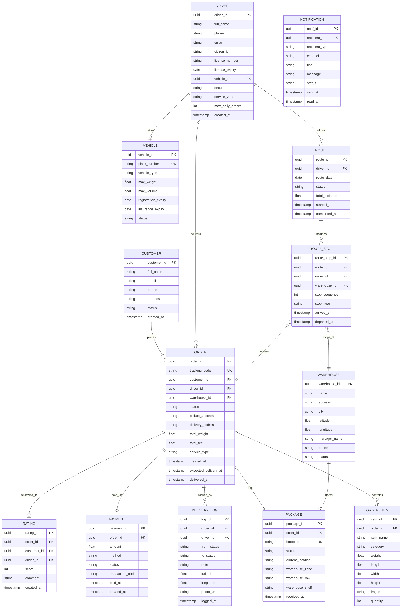
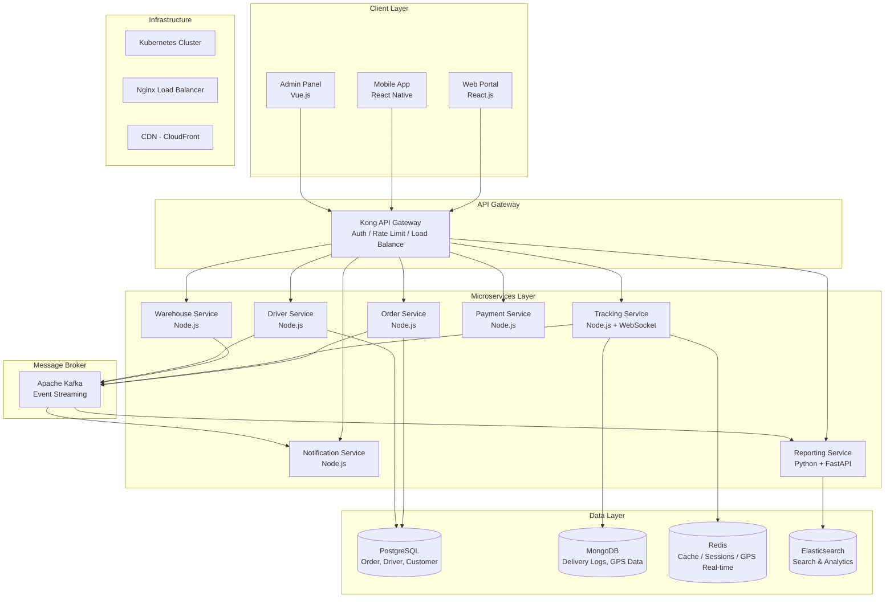
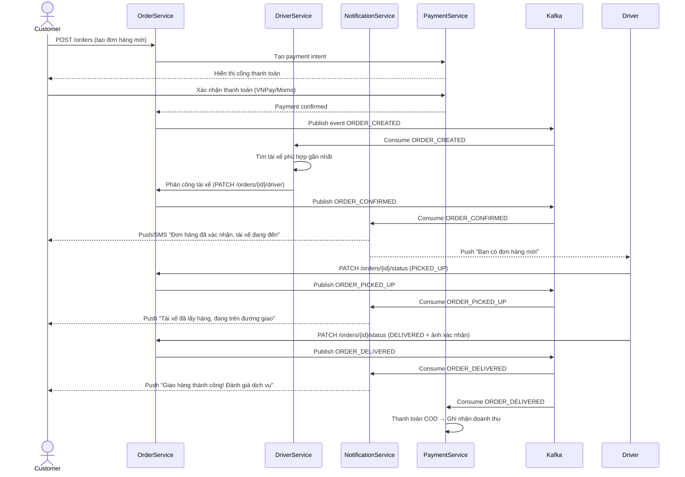
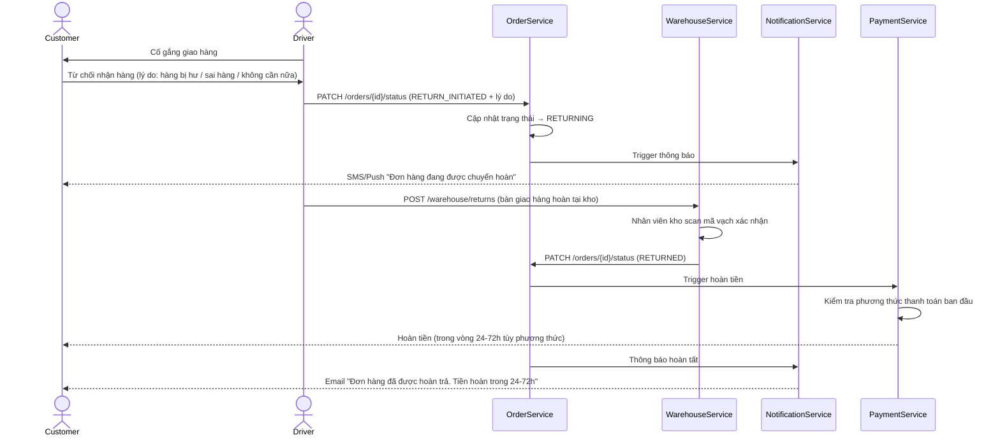

# DELIVEREASE
## Hệ Thống Quản Lý Giao Nhận & Logistics

---

**Tài liệu Đặc Tả Yêu Cầu Phần Mềm**
*(Software Requirements Specification — SRS)*

| Thông tin | Chi tiết |
|-----------|----------|
| **Tên hệ thống** | DeliverEase – Nền tảng Quản lý Giao nhận & Logistics |
| **Phiên bản tài liệu** | v1.0 |
| **Ngày tạo** | 02/07/2026 |
| **Trạng thái** | Bản Chính Thức |
| **Phân loại** | Tài liệu Kỹ thuật Nội bộ |

---

## TÓM TẮT ĐIỀU HÀNH *(Executive Summary)*

DeliverEase là nền tảng quản lý giao nhận và logistics thế hệ mới, được thiết kế để giải quyết triệt để các điểm đau trong hoạt động vận chuyển hàng hóa của các doanh nghiệp vừa và lớn tại Việt Nam. Trong bối cảnh thương mại điện tử tăng trưởng mạnh mẽ, áp lực giao hàng nhanh và chính xác ngày càng cao, các giải pháp quản lý truyền thống dựa trên bảng tính và điện thoại không còn đáp ứng được yêu cầu.

DeliverEase cung cấp một hệ sinh thái kỹ thuật số khép kín, kết nối đồng bộ giữa khách hàng, tài xế, kho hàng và ban quản lý trên một nền tảng duy nhất. Hệ thống cho phép theo dõi đơn hàng theo thời gian thực, tối ưu hóa lộ trình giao hàng, tự động hóa thông báo và cung cấp báo cáo phân tích sâu giúp ban lãnh đạo ra quyết định dựa trên dữ liệu.

Sau khi triển khai, DeliverEase dự kiến giúp doanh nghiệp:
- **Giảm 30%** chi phí vận hành nhờ tối ưu hóa lộ trình và giảm thiểu sai sót
- **Tăng 25%** tỷ lệ giao hàng thành công trong lần đầu tiên
- **Rút ngắn 40%** thời gian xử lý đơn hàng nhờ tự động hóa quy trình

---

## MỤC LỤC

1. [Giới thiệu & Tổng quan Hệ thống](#1-giới-thiệu--tổng-quan-hệ-thống)
2. [Các Đối Tượng Người Dùng (Actors)](#2-các-đối-tượng-người-dùng-actors)
3. [User Stories & Acceptance Criteria](#3-user-stories--acceptance-criteria)
4. [Use Case Diagram](#4-use-case-diagram)
5. [Đặc Tả Yêu Cầu Chức Năng](#5-đặc-tả-yêu-cầu-chức-năng)
6. [Yêu Cầu Phi Chức Năng](#6-yêu-cầu-phi-chức-năng)
7. [Entity Relationship Diagram (ERD)](#7-entity-relationship-diagram-erd)
8. [Kiến Trúc Hệ Thống](#8-kiến-trúc-hệ-thống)
9. [Sequence Diagrams](#9-sequence-diagrams)
10. [Ràng Buộc Dữ Liệu & Quy Tắc Nghiệp Vụ](#10-ràng-buộc-dữ-liệu--quy-tắc-nghiệp-vụ)
11. [Bảng Thuật Ngữ (Glossary)](#11-bảng-thuật-ngữ-glossary)

---

## 1. GIỚI THIỆU & TỔNG QUAN HỆ THỐNG

### 1.1 Tổng Quan Hệ Thống

**Bài toán thực tế:**
Các doanh nghiệp logistics và thương mại điện tử tại Việt Nam đang đối mặt với hàng loạt thách thức nghiêm trọng:

- **Thiếu minh bạch thông tin:** Khách hàng không biết đơn hàng đang ở đâu; phải gọi điện hỏi thủ công
- **Quy trình thủ công, phân tán:** Đơn hàng được quản lý qua Excel, Zalo, điện thoại — dễ sai sót và thất thoát
- **Không tối ưu lộ trình:** Tài xế tự sắp xếp chuyến đi, gây lãng phí nhiên liệu và thời gian
- **Thiếu dữ liệu để ra quyết định:** Quản lý không có báo cáo tức thời về hiệu suất giao hàng
- **Khó khăn trong xử lý sự cố:** Khi hàng thất lạc hoặc hư hỏng, không có nhật ký theo dõi rõ ràng

**Quy mô doanh nghiệp mục tiêu:**
- Doanh nghiệp vừa và lớn (SME-Enterprise) trong lĩnh vực logistics, chuyển phát nhanh, và thương mại điện tử
- Quy mô: 50–500 tài xế, 5–50 kho hàng, xử lý 1.000–50.000 đơn hàng/ngày

### 1.2 Mục Tiêu Dự Án *(SMART Goals)*

| # | Mục tiêu | Chỉ số đo lường | Thời hạn |
|---|----------|-----------------|----------|
| G1 | Tỷ lệ giao hàng thành công lần đầu ≥ 92% | % đơn DELIVERED / tổng đơn dispatched | Sau 6 tháng triển khai |
| G2 | Thời gian xử lý đơn hàng từ tiếp nhận → giao cho tài xế ≤ 30 phút | Đo bằng timestamp hệ thống | Ngay khi go-live |
| G3 | Giảm chi phí vận hành (nhiên liệu, nhân công thủ công) ≥ 25% | So sánh chi phí trước/sau | Sau 12 tháng |
| G4 | Customer Satisfaction Score (CSAT) ≥ 4.2/5.0 | Rating trung bình từ module Đánh giá | Sau 3 tháng |
| G5 | Hệ thống xử lý ≥ 10.000 đơn hàng đồng thời | Load testing | Trước khi go-live |
| G6 | Uptime hệ thống ≥ 99.5% | Monitoring tool (Datadog/Grafana) | Liên tục |

### 1.3 Phạm Vi Hệ Thống

**IN SCOPE (Trong phạm vi):**
- Quản lý toàn bộ vòng đời đơn hàng từ tạo đến hoàn tất/trả hàng
- Theo dõi lộ trình tài xế và vị trí đơn hàng theo thời gian thực (GPS)
- Quản lý kho hàng, nhập/xuất kiện hàng
- Quản lý thông tin tài xế và phương tiện
- Hệ thống thông báo tự động (push notification, SMS, email)
- Module báo cáo và phân tích hiệu suất
- Tích hợp thanh toán điện tử (COD, VNPay, Momo)
- Ứng dụng di động cho tài xế (iOS & Android)
- Cổng web cho khách hàng và quản lý

**OUT OF SCOPE (Ngoài phạm vi):**
- Hệ thống kế toán và tài chính doanh nghiệp (ERP)
- Quản lý nhân sự và bảng lương
- Mua sắm phương tiện / quản lý bảo dưỡng xe
- Tích hợp với hệ thống hải quan và xuất nhập khẩu quốc tế
- Dịch vụ giao hàng xuyên biên giới

---

## 2. CÁC ĐỐI TƯỢNG NGƯỜI DÙNG (ACTORS)

### Actor 1: Khách Hàng *(Customer)*
| Thuộc tính | Mô tả |
|------------|-------|
| **Vai trò** | Người đặt và nhận đơn hàng |
| **Trình độ kỹ thuật** | Cơ bản – trung bình (dùng smartphone hàng ngày) |
| **Mục tiêu chính** | Đặt đơn dễ dàng, theo dõi hàng hóa theo thời gian thực, nhận hàng đúng hẹn |
| **Quyền truy cập** | Chỉ xem đơn hàng của chính mình; không truy cập được dữ liệu hệ thống |
| **Kênh sử dụng** | Web portal, Mobile App |

### Actor 2: Tài Xế / Shipper *(Driver)*
| Thuộc tính | Mô tả |
|------------|-------|
| **Vai trò** | Thực hiện lấy hàng tại kho và giao đến tay khách hàng |
| **Trình độ kỹ thuật** | Cơ bản (biết dùng app điện thoại) |
| **Mục tiêu chính** | Nhận lộ trình rõ ràng, cập nhật trạng thái giao hàng nhanh, báo cáo sự cố |
| **Quyền truy cập** | Chỉ xem các đơn hàng được phân công cho mình; cập nhật trạng thái đơn |
| **Kênh sử dụng** | Mobile App (tối ưu cho driver) |

### Actor 3: Nhân Viên Kho *(Warehouse Staff)*
| Thuộc tính | Mô tả |
|------------|-------|
| **Vai trò** | Tiếp nhận, phân loại, đóng gói và xuất hàng tại kho |
| **Trình độ kỹ thuật** | Trung bình (dùng máy tính và máy quét mã vạch) |
| **Mục tiêu chính** | Xử lý kiện hàng chính xác, tra cứu thông tin đơn hàng nhanh |
| **Quyền truy cập** | Quản lý hàng hóa trong kho được phân công; không chỉnh sửa thông tin khách hàng |
| **Kênh sử dụng** | Web (tablet/desktop tại kho), máy quét barcode |

### Actor 4: Điều Phối Viên *(Dispatcher)*
| Thuộc tính | Mô tả |
|------------|-------|
| **Vai trò** | Phân công đơn hàng cho tài xế, tối ưu lộ trình, xử lý sự cố vận chuyển |
| **Trình độ kỹ thuật** | Trung bình – cao |
| **Mục tiêu chính** | Phân bổ nguồn lực tối ưu, theo dõi fleet trên bản đồ, xử lý ngoại lệ |
| **Quyền truy cập** | Toàn bộ module Vận hành; không chỉnh sửa dữ liệu tài chính |
| **Kênh sử dụng** | Web (màn hình lớn, bản đồ real-time) |

### Actor 5: Quản Lý *(Manager)*
| Thuộc tính | Mô tả |
|------------|-------|
| **Vai trò** | Giám sát hiệu suất tổng thể, ra quyết định chiến lược |
| **Trình độ kỹ thuật** | Trung bình (dùng dashboard và báo cáo) |
| **Mục tiêu chính** | Xem báo cáo KPI, phân tích xu hướng, quản lý hiệu suất nhân sự |
| **Quyền truy cập** | Xem tất cả báo cáo; không chỉnh sửa dữ liệu vận hành trực tiếp |
| **Kênh sử dụng** | Web (dashboard), Mobile App (xem báo cáo) |

### Actor 6: Quản Trị Hệ Thống *(System Admin)*
| Thuộc tính | Mô tả |
|------------|-------|
| **Vai trò** | Quản lý cấu hình hệ thống, tài khoản người dùng, và bảo mật |
| **Trình độ kỹ thuật** | Cao (chuyên môn IT) |
| **Mục tiêu chính** | Đảm bảo hệ thống hoạt động ổn định, phân quyền đúng đắn |
| **Quyền truy cập** | Toàn quyền hệ thống |
| **Kênh sử dụng** | Web Admin Panel |

---

## 3. USER STORIES & ACCEPTANCE CRITERIA

### 3.1 Khách Hàng (Customer)

**US-C01:** Với tư cách là Khách hàng, tôi muốn tạo đơn hàng mới với thông tin giao hàng đầy đủ để yêu cầu dịch vụ vận chuyển.
> *Acceptance Criteria:*
> - Form đặt hàng có đầy đủ trường: địa chỉ lấy hàng, giao hàng, loại hàng, trọng lượng, ghi chú
> - Hệ thống tự động tính phí ship và hiển thị trước khi xác nhận
> - Sau khi đặt thành công, hệ thống sinh mã vận đơn duy nhất và gửi xác nhận qua email/SMS

**US-C02:** Với tư cách là Khách hàng, tôi muốn theo dõi đơn hàng theo thời gian thực trên bản đồ để biết hàng hóa đang ở đâu.
> *Acceptance Criteria:*
> - Bản đồ hiển thị vị trí tài xế cập nhật mỗi 30 giây
> - Hiển thị thời gian giao hàng dự kiến (ETA) chính xác trong vòng ±15 phút
> - Có timeline lịch sử các trạng thái đơn hàng (PENDING → PICKED_UP → IN_TRANSIT → DELIVERED)

**US-C03:** Với tư cách là Khách hàng, tôi muốn đánh giá chất lượng dịch vụ giao hàng sau khi nhận hàng để giúp cải thiện dịch vụ.
> *Acceptance Criteria:*
> - Thông báo mời đánh giá được gửi trong vòng 1 giờ sau khi đơn hàng DELIVERED
> - Giao diện đánh giá từ 1-5 sao kèm nhận xét văn bản (tùy chọn)
> - Đánh giá chỉ được thực hiện 1 lần duy nhất cho mỗi đơn hàng

**US-C04:** Với tư cách là Khách hàng, tôi muốn xem lịch sử tất cả đơn hàng của mình để quản lý việc mua sắm và giao nhận.
> *Acceptance Criteria:*
> - Danh sách hiển thị đầy đủ: mã vận đơn, ngày đặt, trạng thái, phí ship
> - Có bộ lọc theo trạng thái, khoảng thời gian và tìm kiếm theo mã vận đơn
> - Có thể xem chi tiết từng đơn hàng và tải hóa đơn PDF

**US-C05:** Với tư cách là Khách hàng, tôi muốn hủy đơn hàng trước khi tài xế đến lấy hàng để thay đổi kế hoạch mà không bị tính phí.
> *Acceptance Criteria:*
> - Nút hủy chỉ hiển thị khi đơn hàng đang ở trạng thái PENDING hoặc CONFIRMED
> - Sau khi hủy, hệ thống tự động hoàn tiền (nếu đã thanh toán trước) trong vòng 24 giờ
> - Hệ thống gửi thông báo hủy đến tài xế (nếu đã được phân công)

**US-C06:** Với tư cách là Khách hàng, tôi muốn tra cứu đơn hàng bằng mã vận đơn mà không cần đăng nhập để tiện kiểm tra nhanh.
> *Acceptance Criteria:*
> - Trang tra cứu công khai, không yêu cầu đăng nhập
> - Nhập mã vận đơn → hiển thị trạng thái hiện tại và lịch sử di chuyển
> - Ẩn thông tin nhạy cảm (số điện thoại đầy đủ, địa chỉ chính xác) với người dùng chưa đăng nhập

### 3.2 Tài Xế / Shipper (Driver)

**US-D01:** Với tư cách là Tài xế, tôi muốn xem danh sách đơn hàng được phân công trong ngày theo lộ trình tối ưu để giao hàng hiệu quả.
> *Acceptance Criteria:*
> - Danh sách sắp xếp theo lộ trình tối ưu (thuật toán TSP hoặc tích hợp Google Maps API)
> - Mỗi đơn hiển thị: địa chỉ, số điện thoại khách, loại hàng, ghi chú đặc biệt
> - Có chức năng điều hướng tích hợp (mở Google Maps/Waze)

**US-D02:** Với tư cách là Tài xế, tôi muốn cập nhật trạng thái đơn hàng ngay trên điện thoại để điều phối viên nắm được tình hình thực tế.
> *Acceptance Criteria:*
> - Giao diện cập nhật trạng thái bằng 1-2 thao tác chạm (không quá 3 bước)
> - Khi chọn DELIVERED, yêu cầu chụp ảnh xác nhận hoặc chữ ký khách hàng
> - Cập nhật đồng bộ ngay lập tức với hệ thống (không delay quá 5 giây)

**US-D03:** Với tư cách là Tài xế, tôi muốn báo cáo sự cố trong quá trình giao hàng (xe hỏng, tai nạn, không liên hệ được khách) để được hỗ trợ kịp thời.
> *Acceptance Criteria:*
> - Form báo cáo sự cố có danh mục: Xe hỏng, Tai nạn, Không liên hệ được khách, Hàng bị hư hỏng, Khác
> - Sau khi gửi báo cáo, điều phối viên được thông báo ngay trong vòng 30 giây
> - Đơn hàng tự động chuyển sang trạng thái ON_HOLD chờ xử lý

**US-D04:** Với tư cách là Tài xế, tôi muốn xem lịch sử giao hàng và thu nhập của mình để tự quản lý hiệu suất.
> *Acceptance Criteria:*
> - Hiển thị số đơn hoàn thành, tỷ lệ thành công, thu nhập theo ngày/tuần/tháng
> - Có biểu đồ trực quan về hiệu suất theo thời gian
> - Dữ liệu được cập nhật cuối mỗi ngày

### 3.3 Nhân Viên Kho (Warehouse Staff)

**US-W01:** Với tư cách là Nhân viên kho, tôi muốn scan mã vạch để tiếp nhận kiện hàng vào kho nhanh chóng và chính xác.
> *Acceptance Criteria:*
> - Quét mã vạch → hệ thống tự điền thông tin đơn hàng, chỉ cần xác nhận
> - Nếu mã vạch không tồn tại trong hệ thống, cảnh báo ngay lập tức
> - Ghi nhận timestamp và ID nhân viên cho mỗi lần tiếp nhận

**US-W02:** Với tư cách là Nhân viên kho, tôi muốn xem danh sách kiện hàng cần xuất kho trong ngày để chuẩn bị hàng cho tài xế.
> *Acceptance Criteria:*
> - Danh sách được sắp xếp theo giờ lấy hàng dự kiến của từng tài xế
> - Có thể in phiếu xuất kho cho từng tài xế
> - Xác nhận xuất kho bằng scan mã vạch hoặc checkbox

**US-W03:** Với tư cách là Nhân viên kho, tôi muốn quản lý vị trí lưu trữ của từng kiện hàng trong kho để tìm hàng nhanh hơn.
> *Acceptance Criteria:*
> - Gán vị trí kho (Zone-Row-Shelf) cho từng kiện hàng khi nhập kho
> - Tra cứu vị trí kiện hàng bằng mã đơn hoặc mã vạch trong vòng 2 giây
> - Cảnh báo khi kiện hàng đã ở kho quá 3 ngày chưa xuất

**US-W04:** Với tư cách là Nhân viên kho, tôi muốn xử lý đơn hàng hoàn trả (return) từ tài xế để cập nhật tồn kho chính xác.
> *Acceptance Criteria:*
> - Giao diện tiếp nhận hàng hoàn trả với lý do (từ chối nhận, địa chỉ sai, hàng lỗi)
> - Tự động cập nhật trạng thái đơn thành RETURNED
> - Thông báo cho bộ phận chăm sóc khách hàng xử lý tiếp

### 3.4 Điều Phối Viên (Dispatcher)

**US-DP01:** Với tư cách là Điều phối viên, tôi muốn phân công đơn hàng cho tài xế phù hợp dựa trên vị trí và năng lực để tối ưu hiệu quả giao hàng.
> *Acceptance Criteria:*
> - Bản đồ real-time hiển thị vị trí và trạng thái (rảnh/bận) của tất cả tài xế
> - Gợi ý tự động tài xế phù hợp nhất dựa trên khoảng cách và tải hiện tại
> - Có thể kéo-thả để phân công và điều chỉnh lộ trình

**US-DP02:** Với tư cách là Điều phối viên, tôi muốn xử lý sự cố giao hàng bằng cách phân công lại tài xế khác để đảm bảo đơn hàng vẫn được giao đúng hạn.
> *Acceptance Criteria:*
> - Nhận cảnh báo ngay khi tài xế báo sự cố
> - Tìm kiếm tài xế thay thế gần nhất trong bán kính 5km
> - Phân công lại trong vòng 2 phút từ khi nhận cảnh báo

**US-DP03:** Với tư cách là Điều phối viên, tôi muốn xem bảng điều khiển (dashboard) tổng quan về toàn bộ hoạt động giao hàng trong ngày để phát hiện sớm vấn đề.
> *Acceptance Criteria:*
> - Dashboard hiển thị: tổng đơn hôm nay, % hoàn thành, số đơn trễ, số sự cố
> - Dữ liệu cập nhật mỗi 60 giây
> - Có bộ lọc theo khu vực, tài xế, và trạng thái đơn

### 3.5 Quản Lý (Manager)

**US-M01:** Với tư cách là Quản lý, tôi muốn xem báo cáo hiệu suất giao hàng theo từng tài xế để đánh giá năng lực và khen thưởng hợp lý.
> *Acceptance Criteria:*
> - Báo cáo gồm: số đơn hoàn thành, tỷ lệ thành công, điểm đánh giá TB, tổng km di chuyển
> - Có thể so sánh hiệu suất giữa các tài xế hoặc giữa các kỳ
> - Xuất báo cáo ra Excel/PDF với một nút bấm

**US-M02:** Với tư cách là Quản lý, tôi muốn xem báo cáo doanh thu và chi phí vận hành theo tuần/tháng/quý để đưa ra quyết định kinh doanh.
> *Acceptance Criteria:*
> - Biểu đồ xu hướng doanh thu, chi phí nhiên liệu, tỷ lệ lợi nhuận theo thời gian
> - Phân tích theo khu vực địa lý (tỉnh/thành phố)
> - Cảnh báo khi chi phí vượt ngưỡng ngân sách đã đặt

**US-M03:** Với tư cách là Quản lý, tôi muốn xem báo cáo hiệu suất giao hàng theo từng tài xế để đánh giá năng lực và điều phối nhân sự phù hợp.
> *Acceptance Criteria:*
> - Bảng xếp hạng tài xế theo KPI (tỷ lệ thành công, tốc độ giao hàng, điểm đánh giá)
> - Hiển thị tài xế có hiệu suất thấp hơn ngưỡng tối thiểu với màu cảnh báo
> - Có thể đặt ngưỡng KPI tùy chỉnh

### 3.6 Hệ Thống Tự Động (System-Generated)

**US-SYS01:** Với tư cách là Hệ thống, tôi muốn tự động gửi thông báo khi đơn hàng trễ hơn thời gian dự kiến để khách hàng và điều phối viên chủ động xử lý.
> *Acceptance Criteria:*
> - Cảnh báo trễ được kích hoạt khi ETA vượt quá 20% so với thời gian dự kiến ban đầu
> - Gửi thông báo đồng thời đến khách hàng (push/SMS) và điều phối viên (in-app alert)
> - Kèm gợi ý hành động: liên hệ tài xế, điều phối lại, xin lỗi khách hàng

---

## 4. USE CASE DIAGRAM

```mermaid
graph TB
    subgraph "DeliverEase System Boundary"
        subgraph "Module: Quản lý Đơn Hàng"
            UC1[Tạo đơn hàng mới]
            UC2[Tra cứu đơn hàng]
            UC3[Hủy đơn hàng]
            UC4[Xem lịch sử đơn hàng]
            UC5[Tích hợp thanh toán điện tử]
            UC6[Tra cứu qua mã vận đơn]
        end
        subgraph "Module: Theo dõi & Vận hành"
            UC7[Theo dõi GPS real-time]
            UC8[Cập nhật trạng thái đơn hàng]
            UC9[Xác nhận giao hàng thành công]
            UC10[Yêu cầu chữ ký xác nhận]
            UC11[Báo cáo sự cố]
            UC12[Phân công tài xế]
            UC13[Tối ưu lộ trình]
        end
        subgraph "Module: Quản lý Kho"
            UC14[Tiếp nhận hàng vào kho]
            UC15[Xuất hàng cho tài xế]
            UC16[Xử lý hàng hoàn trả]
            UC17[Quản lý vị trí kho]
        end
        subgraph "Module: Báo cáo & Thống kê"
            UC18[Xem dashboard tổng quan]
            UC19[Xem báo cáo hiệu suất tài xế]
            UC20[Xem báo cáo doanh thu]
            UC21[Xuất báo cáo Excel/PDF]
        end
        subgraph "Module: Tài xế & Phương tiện"
            UC22[Quản lý hồ sơ tài xế]
            UC23[Quản lý phương tiện]
            UC24[Xem lịch sử & thu nhập]
        end
    end

    Customer([👤 Khách Hàng])
    Driver([🚗 Tài Xế])
    WarehouseStaff([📦 Nhân Viên Kho])
    Dispatcher([🗺️ Điều Phối Viên])
    Manager([👔 Quản Lý])
    Admin([⚙️ System Admin])
    ExtNotif([🔔 External Notification System])

    Customer --> UC1
    Customer --> UC2
    Customer --> UC3
    Customer --> UC4
    Customer --> UC6
    Customer --> UC25[Đánh giá dịch vụ]

    Driver --> UC8
    Driver --> UC7
    Driver --> UC11
    Driver --> UC24
    
    WarehouseStaff --> UC14
    WarehouseStaff --> UC15
    WarehouseStaff --> UC16
    WarehouseStaff --> UC17

    Dispatcher --> UC12
    Dispatcher --> UC13
    Dispatcher --> UC18
    
    Manager --> UC18
    Manager --> UC19
    Manager --> UC20
    Manager --> UC21

    Admin --> UC22
    Admin --> UC23

    UC1 -->|include| UC5
    UC9 -->|extend| UC10
    UC8 -->|include| UC7
    ExtNotif -.->|notifies| Customer
    ExtNotif -.->|notifies| Driver
```

---

## 5. ĐẶC TẢ YÊU CẦU CHỨC NĂNG

### 5.1 Module 1: Quản Lý Đơn Hàng *(Order Management)*

| Mã | Chức năng | Mô tả chi tiết | Ưu tiên |
|----|-----------|----------------|---------|
| FR-OM-01 | Tạo đơn hàng | Khách hàng/Staff tạo đơn với đầy đủ thông tin: người gửi, người nhận, loại hàng, trọng lượng, kích thước, dịch vụ (tiêu chuẩn/nhanh/hỏa tốc) | Must Have |
| FR-OM-02 | Tính phí vận chuyển tự động | Hệ thống tính phí dựa trên: trọng lượng, khoảng cách, loại dịch vụ, vùng giá | Must Have |
| FR-OM-03 | Sinh mã vận đơn | Tạo mã vận đơn duy nhất (format: DE + YYYYMMDD + 6 số ngẫu nhiên) | Must Have |
| FR-OM-04 | Quản lý trạng thái đơn hàng | Vòng đời: PENDING → CONFIRMED → PICKED_UP → IN_TRANSIT → DELIVERED / CANCELLED / RETURNED | Must Have |
| FR-OM-05 | Tích hợp thanh toán | Hỗ trợ COD, VNPay, Momo, thẻ ngân hàng | Must Have |
| FR-OM-06 | Gửi thông báo tự động | Email/SMS/Push khi đơn hàng thay đổi trạng thái | Must Have |
| FR-OM-07 | Hủy đơn hàng | Cho phép hủy khi chưa có tài xế nhận; tự động hoàn tiền nếu đã thanh toán | Must Have |
| FR-OM-08 | Tra cứu đơn hàng | Tra cứu bằng mã vận đơn, không cần đăng nhập | Must Have |
| FR-OM-09 | Đặt lịch lấy hàng | Khách hàng chọn khung giờ lấy hàng mong muốn | Should Have |
| FR-OM-10 | Tạo đơn hàng hàng loạt | Import file CSV để tạo nhiều đơn hàng cùng lúc | Could Have |

### 5.2 Module 2: Theo Dõi Lộ Trình *(Route Tracking)*

| Mã | Chức năng | Mô tả chi tiết | Ưu tiên |
|----|-----------|----------------|---------|
| FR-RT-01 | Theo dõi GPS thời gian thực | Vị trí tài xế cập nhật mỗi 30 giây, hiển thị trên bản đồ | Must Have |
| FR-RT-02 | Tính toán ETA | Ước tính thời gian giao hàng dựa trên tuyến đường và tình trạng giao thông | Must Have |
| FR-RT-03 | Tối ưu hóa lộ trình | Tính toán lộ trình tối ưu cho nhiều điểm giao hàng (Vehicle Routing Problem) | Must Have |
| FR-RT-04 | Lịch sử di chuyển | Lưu và hiển thị toàn bộ lộ trình thực tế của tài xế trong ngày | Must Have |
| FR-RT-05 | Cảnh báo đơn hàng trễ | Tự động cảnh báo khi ETA vượt quá thời hạn dự kiến 20% | Must Have |
| FR-RT-06 | Tích hợp bản đồ | Điều hướng tích hợp Google Maps API / Mapbox | Must Have |
| FR-RT-07 | Geofencing | Tự động cập nhật trạng thái khi tài xế vào/ra khỏi vùng địa lý được định nghĩa | Should Have |

### 5.3 Module 3: Quản Lý Kho *(Warehouse Management)*

| Mã | Chức năng | Mô tả chi tiết | Ưu tiên |
|----|-----------|----------------|---------|
| FR-WH-01 | Tiếp nhận hàng vào kho | Scan mã vạch hoặc nhập thủ công để tiếp nhận kiện hàng | Must Have |
| FR-WH-02 | Quản lý vị trí kho | Gán và tra cứu vị trí lưu trữ (Zone-Row-Shelf) cho từng kiện hàng | Must Have |
| FR-WH-03 | Xuất hàng cho tài xế | Xác nhận bàn giao hàng từ kho cho tài xế bằng scan mã vạch | Must Have |
| FR-WH-04 | Tiếp nhận hàng hoàn trả | Xử lý kiện hàng tài xế trả về với lý do hoàn trả | Must Have |
| FR-WH-05 | Kiểm kê hàng tồn kho | Báo cáo danh sách kiện hàng đang trong kho theo thời gian thực | Must Have |
| FR-WH-06 | Cảnh báo hàng tồn lâu | Thông báo khi kiện hàng tồn kho quá 3 ngày chưa xuất | Should Have |
| FR-WH-07 | Quản lý nhiều kho | Hỗ trợ chuỗi nhiều kho tại các địa điểm khác nhau | Should Have |

### 5.4 Module 4: Báo Cáo & Thống Kê *(Reporting & Analytics)*

| Mã | Chức năng | Mô tả chi tiết | Ưu tiên |
|----|-----------|----------------|---------|
| FR-RP-01 | Dashboard tổng quan | KPIs real-time: tổng đơn, % hoàn thành, đơn trễ, doanh thu hôm nay | Must Have |
| FR-RP-02 | Báo cáo hiệu suất tài xế | Xếp hạng tài xế theo KPI: tỷ lệ giao thành công, số đơn, điểm đánh giá | Must Have |
| FR-RP-03 | Báo cáo doanh thu | Doanh thu theo ngày/tuần/tháng, phân tích theo khu vực | Must Have |
| FR-RP-04 | Báo cáo hiệu suất kho | Thời gian xử lý trung bình, tỷ lệ xuất nhập kho | Should Have |
| FR-RP-05 | Xuất dữ liệu | Xuất ra Excel (.xlsx) và PDF với định dạng chuyên nghiệp | Must Have |
| FR-RP-06 | Phân tích xu hướng | Biểu đồ đường/cột thể hiện xu hướng theo thời gian | Should Have |
| FR-RP-07 | Báo cáo lý do hoàn trả | Thống kê các lý do giao hàng thất bại | Should Have |

### 5.5 Module 5: Quản Lý Tài Xế & Phương Tiện *(Driver & Fleet Management)*

| Mã | Chức năng | Mô tả chi tiết | Ưu tiên |
|----|-----------|----------------|---------|
| FR-DF-01 | Quản lý hồ sơ tài xế | CRUD thông tin: họ tên, CCCD, GPLX, ảnh, liên hệ, vùng phụ trách | Must Have |
| FR-DF-02 | Quản lý phương tiện | Thông tin xe: biển số, loại xe, sức chứa, ngày đăng kiểm, bảo hiểm | Must Have |
| FR-DF-03 | Gán xe cho tài xế | Liên kết tài xế với phương tiện, theo dõi lịch sử sử dụng xe | Must Have |
| FR-DF-04 | Theo dõi tình trạng hoạt động | Trạng thái tài xế: Đang trực, Đang giao, Nghỉ, Ngoại tuyến | Must Have |
| FR-DF-05 | Quản lý tải (capacity) | Giới hạn số đơn và tổng trọng lượng tối đa mỗi tài xế/xe | Must Have |
| FR-DF-06 | Lịch làm việc | Đặt lịch trực và nghỉ phép cho tài xế | Should Have |
| FR-DF-07 | Cảnh báo giấy tờ hết hạn | Thông báo trước 30 ngày khi GPLX hoặc đăng kiểm sắp hết hạn | Should Have |

---

## 6. YÊU CẦU PHI CHỨC NĂNG

### 6.1 Hiệu Năng *(Performance)*
| Mã | Yêu cầu | Chỉ số đo lường |
|----|---------|-----------------|
| NFR-P01 | Thời gian phản hồi API | ≤ 200ms cho 95% requests trong điều kiện bình thường |
| NFR-P02 | Thời gian tải trang | ≤ 2 giây cho trang dashboard chính (LCP) |
| NFR-P03 | Xử lý đồng thời | Hỗ trợ ≥ 10.000 người dùng online đồng thời |
| NFR-P04 | Xử lý đơn hàng | ≥ 1.000 đơn hàng mới/phút trong giờ cao điểm |
| NFR-P05 | Cập nhật GPS | Độ trễ ≤ 5 giây từ tài xế gửi đến client nhận |

### 6.2 Bảo Mật *(Security)*
| Mã | Yêu cầu | Chỉ số đo lường |
|----|---------|-----------------|
| NFR-S01 | Xác thực người dùng | JWT token, hết hạn sau 24h, refresh token 30 ngày |
| NFR-S02 | Mã hóa dữ liệu | HTTPS/TLS 1.3 cho mọi giao tiếp; AES-256 cho dữ liệu nhạy cảm tại rest |
| NFR-S03 | Phân quyền RBAC | Role-Based Access Control, nguyên tắc Least Privilege |
| NFR-S04 | Audit log | Ghi nhật ký mọi hành động CRUD với timestamp và user ID |
| NFR-S05 | Rate limiting | Giới hạn 100 requests/phút/IP cho API public; 1000/phút cho user đã xác thực |

### 6.3 Khả Năng Mở Rộng *(Scalability)*
| Mã | Yêu cầu | Mô tả |
|----|---------|-------|
| NFR-SC01 | Horizontal scaling | Hỗ trợ scale-out không giới hạn bằng container (Docker/Kubernetes) |
| NFR-SC02 | Database sharding | Hỗ trợ phân vùng dữ liệu theo khu vực địa lý khi quy mô tăng |
| NFR-SC03 | Kiến trúc microservices | Mỗi module có thể scale độc lập |

### 6.4 Độ Sẵn Sàng *(Availability)*
| Mã | Yêu cầu | Chỉ số đo lường |
|----|---------|-----------------|
| NFR-A01 | Uptime | ≥ 99.5% (downtime tối đa ~43.8 giờ/năm) |
| NFR-A02 | Bảo trì không gián đoạn | Blue-green deployment, zero-downtime updates |
| NFR-A03 | Backup dữ liệu | Sao lưu tự động mỗi 6 giờ, lưu trữ 30 ngày |
| NFR-A04 | Disaster Recovery | RTO ≤ 4 giờ; RPO ≤ 1 giờ |

### 6.5 Khả Năng Sử Dụng *(Usability)*
| Mã | Yêu cầu | Mô tả |
|----|---------|-------|
| NFR-U01 | Đa ngôn ngữ | Hỗ trợ Tiếng Việt và Tiếng Anh |
| NFR-U02 | Responsive design | Hoạt động tốt trên màn hình từ 320px (mobile) đến 2560px (4K) |
| NFR-U03 | Accessibility | Tuân thủ WCAG 2.1 Level AA |
| NFR-U04 | Onboarding | Tài xế mới có thể sử dụng app cơ bản sau ≤ 15 phút hướng dẫn |

---

## 7. ENTITY RELATIONSHIP DIAGRAM (ERD)

---

## 8. KIẾN TRÚC HỆ THỐNG

### 8.1 Quyết Định Kiến Trúc: Microservices

Hệ thống DeliverEase được xây dựng trên kiến trúc **Microservices** thay vì Monolithic vì các lý do sau:

| Tiêu chí | Lý do chọn Microservices |
|----------|--------------------------|
| **Scalability** | Module Tracking có tải cao hơn nhiều so với module Reporting — có thể scale độc lập |
| **Fault Isolation** | Lỗi ở module Thanh toán không ảnh hưởng đến theo dõi GPS |
| **Team Independence** | Các nhóm phát triển làm việc song song trên các service khác nhau |
| **Technology Flexibility** | Module GPS dùng Node.js (WebSocket), module Analytics dùng Python |
| **Deployment** | Deploy từng service riêng lẻ, không cần downtime toàn hệ thống |

### 8.2 Sơ Đồ Kiến Trúc

### 8.3 Tech Stack

| Layer | Công nghệ | Lý do lựa chọn |
|-------|-----------|----------------|
| **Frontend Web** | React.js 18, TypeScript | Ecosystem lớn, tích hợp bản đồ tốt |
| **Mobile App** | React Native | Code sharing giữa iOS và Android |
| **Backend** | Node.js (Express/Fastify), Python (FastAPI) | Node cho real-time, Python cho analytics |
| **API Gateway** | Kong | Rate limiting, auth, load balancing tích hợp |
| **Database chính** | PostgreSQL 15 | ACID compliance, JSON support |
| **Time-series / GPS** | MongoDB 7 | Linh hoạt với dữ liệu địa lý và logs |
| **Cache / Real-time** | Redis 7 | Pub/Sub cho WebSocket, session storage |
| **Message Broker** | Apache Kafka | Xử lý event stream khối lượng lớn |
| **Search** | Elasticsearch 8 | Tìm kiếm full-text và analytics |
| **Container** | Docker + Kubernetes | Orchestration và auto-scaling |
| **CI/CD** | GitHub Actions | Automated testing và deployment |
| **Monitoring** | Prometheus + Grafana | Metrics và alerting |

### 8.4 Real-time GPS Tracking

Cơ chế theo dõi thời gian thực sử dụng **WebSocket + Redis Pub/Sub**:
1. App tài xế gửi tọa độ GPS mỗi 30 giây → Tracking Service
2. Tracking Service lưu vào Redis (key: `driver:{id}:location`) với TTL 60 giây
3. Đồng thời publish event vào Redis channel `tracking.{order_id}`
4. Client (web/mobile của khách hàng) subscribe vào channel qua WebSocket
5. Bản đồ khách hàng cập nhật tự động không cần refresh

---

## 9. SEQUENCE DIAGRAMS

### 9.1 Luồng: Đặt Đơn → Lấy Hàng → Giao Hàng Thành Công

### 9.2 Luồng: Xử Lý Đơn Hàng Hoàn Trả *(Return Order)*

---

## 10. RÀNG BUỘC DỮ LIỆU & QUY TẮC NGHIỆP VỤ

| # | Quy tắc | Mô tả chi tiết |
|---|---------|----------------|
| BR-01 | Hủy đơn hàng chỉ trong trạng thái cho phép | Đơn hàng chỉ được hủy khi status là PENDING hoặc CONFIRMED. Không thể hủy khi tài xế đã lấy hàng (PICKED_UP trở đi) |
| BR-02 | Giới hạn số đơn tài xế mỗi ngày | Mỗi tài xế không được nhận quá 15 đơn hàng/ngày; không được nhận thêm khi đã đạt giới hạn tải của xe |
| BR-03 | Một đơn - một tài xế | Mỗi đơn hàng chỉ được phân công cho đúng 1 tài xế tại một thời điểm. Phân công lại phải thu hồi phân công cũ trước |
| BR-04 | Mã vận đơn bất biến | Tracking code của đơn hàng không thể thay đổi sau khi tạo |
| BR-05 | Trọng lượng tối đa | Một đơn hàng không được vượt quá sức chứa còn lại của phương tiện được phân công |
| BR-06 | Rating chỉ sau khi giao thành công | Khách hàng chỉ có thể đánh giá sau khi đơn hàng ở trạng thái DELIVERED; mỗi đơn hàng chỉ được đánh giá một lần |
| BR-07 | Xác nhận giao hàng bắt buộc ảnh | Tài xế bắt buộc upload ảnh bằng chứng hoặc thu chữ ký số khi cập nhật DELIVERED |
| BR-08 | Thời hạn đặt lịch lấy hàng | Thời điểm lấy hàng phải cách thời điểm đặt đơn ít nhất 2 giờ |
| BR-09 | Hoàn tiền theo phương thức ban đầu | Hoàn tiền phải về đúng phương thức thanh toán gốc: VNPay → VNPay, Momo → Momo, COD → Tiền mặt |
| BR-10 | Tài xế phải có giấy tờ hợp lệ | Tài xế chỉ được nhận đơn khi GPLX và đăng kiểm xe còn hiệu lực |
| BR-11 | Cảnh báo hàng tồn kho quá hạn | Kiện hàng tồn trong kho quá 72 giờ sẽ được tự động đánh dấu và gửi cảnh báo đến Dispatcher |
| BR-12 | Đơn hàng COD không hoàn tiền online | Đơn COD được hủy trước khi lấy hàng không phát sinh giao dịch hoàn tiền trong hệ thống |

---

## 11. BẢNG THUẬT NGỮ (GLOSSARY)

| Thuật ngữ | Định nghĩa |
|-----------|------------|
| **SRS** | Software Requirements Specification — Tài liệu đặc tả yêu cầu phần mềm, mô tả đầy đủ chức năng và phi chức năng của hệ thống |
| **Actor** | Đối tượng người dùng hoặc hệ thống bên ngoài tương tác với hệ thống được phân tích |
| **Use Case** | Kịch bản mô tả cách một Actor tương tác với hệ thống để đạt được một mục tiêu cụ thể |
| **User Story** | Mô tả yêu cầu người dùng theo định dạng: "Với tư cách là [vai trò], tôi muốn [hành động] để [lợi ích]" |
| **ERD** | Entity Relationship Diagram — Sơ đồ thực thể quan hệ, mô tả cấu trúc dữ liệu |
| **Microservices** | Kiến trúc phần mềm phân tách ứng dụng thành các dịch vụ nhỏ, độc lập, giao tiếp qua API |
| **ETA** | Estimated Time of Arrival — Thời gian dự kiến tài xế đến địa điểm giao hàng |
| **COD** | Cash on Delivery — Hình thức thanh toán tiền mặt khi nhận hàng |
| **Tracking Code** | Mã vận đơn — mã định danh duy nhất cho mỗi đơn hàng, dùng để tra cứu |
| **Dispatcher** | Điều phối viên — nhân viên chịu trách nhiệm phân công và giám sát hoạt động giao hàng |
| **Fleet** | Đội phương tiện — toàn bộ xe và tài xế trong doanh nghiệp vận chuyển |
| **Geofencing** | Kỹ thuật định nghĩa vùng địa lý ảo; hệ thống tự động kích hoạt hành động khi thiết bị vào/ra khỏi vùng |
| **RBAC** | Role-Based Access Control — Phân quyền dựa trên vai trò người dùng |
| **JWT** | JSON Web Token — Chuẩn xác thực stateless sử dụng token được mã hóa |
| **KPI** | Key Performance Indicator — Chỉ số hiệu suất then chốt dùng để đánh giá hiệu quả hoạt động |
| **RTO** | Recovery Time Objective — Thời gian tối đa để khôi phục hệ thống sau sự cố |
| **RPO** | Recovery Point Objective — Lượng dữ liệu tối đa được phép mất khi xảy ra sự cố |
| **CSAT** | Customer Satisfaction Score — Điểm hài lòng của khách hàng, thường được đo qua khảo sát |
| **Kafka** | Apache Kafka — Nền tảng xử lý luồng sự kiện phân tán, dùng để truyền thông tin giữa các microservices |
| **WebSocket** | Giao thức truyền thông 2 chiều liên tục giữa client và server, dùng cho cập nhật real-time |

---

*Tài liệu này được soạn thảo với sự hỗ trợ của AI (Antigravity - Google DeepMind). Phiên bản v1.0 — 02/07/2026.*
